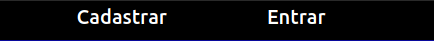
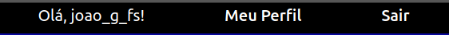
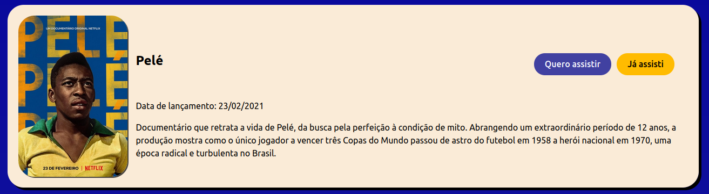
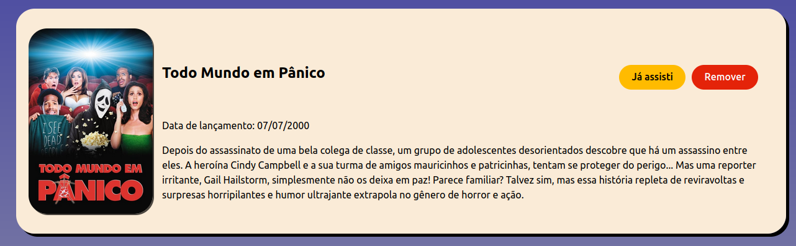
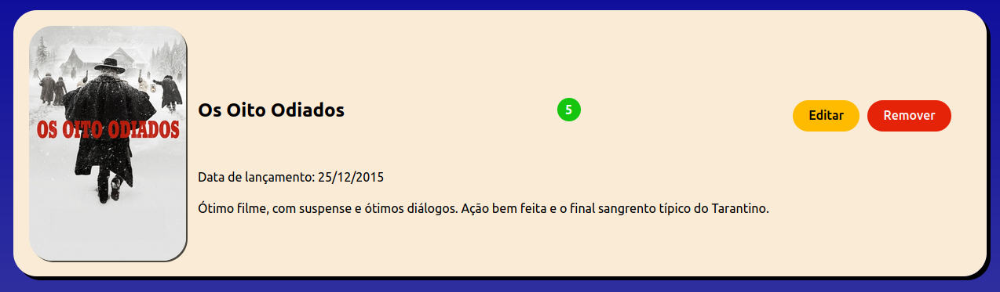

# Site de Avaliação de Filmes 

## Introdução

Durante a rotina é comum ouvir falar de filmes, seja em conversas ou nas redes sociais, se interessar e depois se esquecer dele. Pior ainda, é sentar na frente da TV ou computador e sentir que nada agrada. Tendo isso em vista, foi criado o projeto _**NomeAqui**_, um site de avaliações de filmes, no qual os usuários podem dar notas e fazer uma resenha sobre filmes assistidos, além de registrar em uma lista os filmes que deseja assistir.

## Projeto Final - Programação Web

Este projeto foi feito para a avaliação final da matéria de Programação Web ministrada no curso de Sistemas de Informação da Unifei.

Foi construído em **JavaScript**, utilizando **Node.js** com o framework **Express** para o Backend e **React** com o servidor de desenvolvimento **Vite** para o Frontend.

## Execução do projeto

Para executar o projeto, é necessário ligar os servidores do frontend e backend. Considerando o uso de um terminal Linux a partir da pasta raiz do projeto:

**Frontend**: `cd front/ ; npm run dev`

**Backend**: `cd back/ ; nodemon server.js`

Note que como os dois servidores continuam como um processo contínuo no terminal, é necessário usar duas instâncias de terminal para executar ambos simultaneamente.

## Tecnologias empregadas

### Geral
- Gestor de pacotes: `npm`

- Versionamento: `Git`

- Hospedagem do código: `GitHub`

- Linguagem: `JavaScript`

### Backend
- Runtime do Backend: `Node.js`

- Persistência de dados: Arquivo `.json`

- Sistema de autenticação: `Json Web Token (JWT)`

- Criptografia: `bcrypt`

### Frontend
- Biblioteca UI: `React`

- Servidor de desenvolvimento: `Vite`

- Validação de entradas: `Yup`

- Estilização: `CSS3 (puro)`

## Rotas Backend

As rotas backend foram organizadaz em três separações principais: 
- `/auth`, para autentição e autorização

- `/usuario`, para requisições relacionadas aos dados dos usuários

- `/filmes`, para rotas relacionadas aos dados dos filmes

Rotas `/auth` recebem apenas requisições  com verbo `POST`:
- `/entrar`: Recebe nome de usuário e senha e responde com o token de acesso ou erro, caso as credenciais sejam inválidas

- `/cadastrar`: Recebe nome de usuário, email e senha e respon de com status de sucesso ou erro, dependendo se o usuário ou email sejam únicos ou não no banco de dados

Rotas `/usuario` são todas rotas privadas e aceitam requisições de mais de um verbo `HTTP`:
- `/assistir`:
    - `GET`: retorna todos objetos dos filmes presentes na lista `assistir` do usuário

    - `POST`: inclui novo filme na lista `assistir` do usuário

- `/assistidos`:
    - `GET`: retorna todos objetos dos filmes presentes na lista `assistidos` do usuário

    - `POST`: inclui novo filme e avaliação na lista `assistidos` do usuário

    - `PUT`: atualiza a avaliação de um filme existente na lista `assistidos` do usuário

- `/filme`: recebe apenas requisições `DELETE` e recebe um parâmetro `/:id`. Através dele, o filme referente é apagado das listas `assistir` ou `assistidos`

Rota `/filmes/buscar/:titulo` é a rota que retorna os filmes buscados. Esta rota usa o `titulo` para fazer uma requisição à `API` do **The Movie Database**,  que  foi a escolhida para fornecer os dados da aplicação.

## API The Movie Database

The Movie Database é um banco de dados de filmes, séries e similares. A plataforma disponibiliza uma API gratuida para requisições de vários tipos.

A sintaxe de requisição escolhida pra utilização no projeto foi a de busca por título.

A requisição é feita na url `https://api.themoviedb.org/3/search/movie`, incluindo no `body` o objeto `params` que contém a chave da `API`, o título do filme buscado e a língua da resposta.

## Segurança

### Autenticação
A autenticação é feita usando `Json Web Token`, guardado no `.env` do projeto.

Assim que o usuário faz login no site, é retornado um token de acesso, que é armazenado nos dados de sessão do navegador.

Quando o usuário faz uma requisição em rota privada, o frontend envia o token armazenado na sessão. Se o token for válido, o acesso é liberado. Senão, o backend retorna erro.

### Criptografia
A aplicação backend usa a biblioteca `bcrypt` para encriptar as senhas dos usuários, a fim de proporcionar segurança das informações.

As senhas são encriptadas usando um hash criptográfico, que não é reversível, e adiciona um salt, para aumentar a segurança.

## Telas

O projeto foi organizado em 8 telas, sendo necessário estar autenticado para acessar algumas delas

| Rota | Descrição | Elemento | Privada |
| ----------- | ----------- | ----------- | ----------- |
| `/` | Tela inicial, faz buscas dos filmes | `<App/>` | ❌ |
| `/cadastrar` | Cadastro de usuário | `<TelaCadastro/>` | ❌ |
| `/entrar` | Login de usuário | `<TelaLogin/>` | ❌ |
| `/perfil` | Tela de perfil, contém opções de ver as listas | `<TelaPerfil/>` | ✅ |
| `/avaliar` | Avaliação de filme assistido | `<Avaliacao/>` | ✅ |
| `/avaliar/editar` | Edição de avaliação existente | `<AvaliacaoEdit/>` | ✅ |
| `/filmes-assistidos` | Listagem dos filmes assistidos | `<TelaAssistidos/>` | ✅ |
| `/filmes-assistir` | Listagem dos filmes a assistir | `<TelaAssistir/>` | ✅ |

## Componentes

Foram criados componentes `.jsx` , a fim de facilitar o desenvolvimento e criar uniformidade no design do site:

### `TopBar`: 

Mostra opções de usuário. Quando a sessão ainda não foi iniciada, contém links para `/entrar` ou `/cadastrar`. Quando existe uma sessão, mostra o nome de usuário e opções de navegação e logout

### `Footer` 
Contém o `footer` padrão do projeto

### `CardFilme` 
Mostra o pôster, título, ano de lançamento e sinopse de um filme, contém botões de opções de ação para incluir nas listas, avaliar, editar avaliação e remover da lista atual. Além disso, caso seja um filme avaliado, mostra a nota dada.

## Validação de Entradas

Para validar as entradas nas telas de cadastrar e entrar, foi usada a biblioteca `Yup`.

Através de `schemas`, é possível configurar regras para cada `input` dos formulários, retornando erros caso alguma informação não esteja em conformidade.

## Telas de Rotas Privadas

Para exibir as telas de rotas privadas, é verificado se existe um token de acesso guardado na sessão.

Caso o token exista, a página é renderizada normalmente. Caso não, é retornada uma mensagem que orienta o usuário a iniciar uma sessão.

